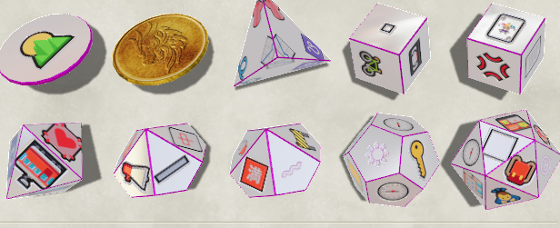
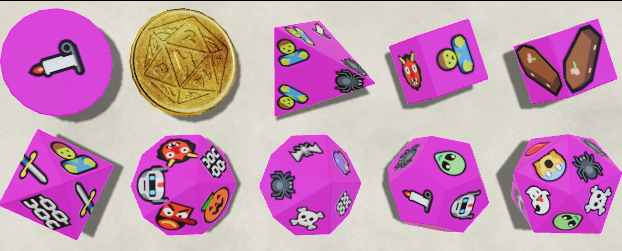
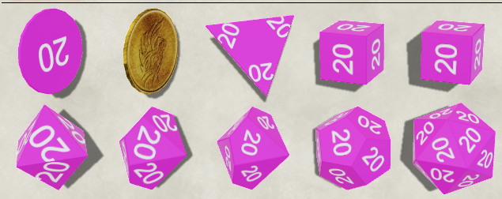
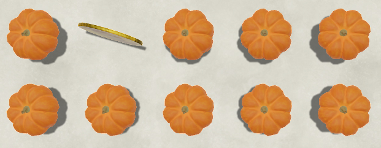
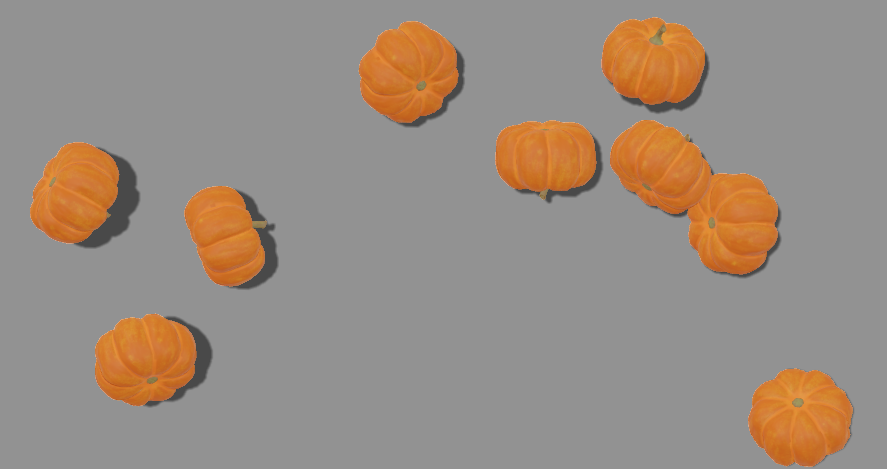

# Orksork's Emoji Dice so Nice Nice Dice
Sometimes my own genius astounds me. Here are some super cool dice to use that your friends will love.



**NOTE: These dice are purely cosmetic. Emojis, and even the 'every face is 20' die are still regular die with 1-n values. They just look different.**

Also I'm forking from LorduFreeman's ['Lordu's Custom Dice for Dice So Nice!'](https://github.com/LorduFreeman/foundry-lordudice) to figure out how to make the dice so I'm just gonna use his README formatting too. Bully for me.

## About/How to use
This module can only be used in conjunction with **Dice So Nice! (minimum version required 3.1.0)** and adds some dice. You can find them in the Dice So Nice settings prefaced with 'ORK'.

### How to use and combine styles
TODO: Forget to do this for 5 years.

ATM I have no custom styles, so combine these face sets with whatever colors and textures you want.


^Picture of me after I finally remember to fill this section out.

## Installation
Use the integrated module manager in Foundry once it's there. If i'm too cool for them still, you can manually use the manifest file URL below:

```
https://raw.githubusercontent.com/Orksork/foundry-emojidice/main/module.json
```

## Visual Previews
### Halloween!



Oops! All 20s!



Who needs dice? Throw pumpkins!





And some *secrets*!


## Feedback
For feedback I can be contacted on Discord at Orksork#8008.

If there are any issues displaying emoji on common devices, feel free to raise an issue here and I'll remove any emojis that can't be displayed widely. (RIP 🫃, which I can't see but I know what it is). I know Majong/Cards have issues ATM, but those were a request so I'm gonna leave them in for a hot minute at least.

If you have suggestions for a set of emojis, make a clean list of your proposed set([see Halloween](data/sets.js#L1))

## Credits
The images here on the README are created by Orksork. With licensing permission given by Orksork.

Made as a fork of Lordudice's dice pack. https://github.com/LorduFreeman/foundry-lordudice

Nic, Tim, & the rest of 'the 7 guys': If it wasn't for playing hilariously named maps in Killing Floor I'd probably have never thought of this idea.

## License
### Code:
This work is licensed under the MIT License: https://mit-license.org

This work is licensed under Foundry Virtual Tabletop [EULA - Limited License Agreement for module development](https://foundryvtt.com/article/license/).

### Art:
"Pumpkin" (https://skfb.ly/6UnQA) by Batuhan13 is licensed under Creative Commons Attribution (http://creativecommons.org/licenses/by/4.0/).

"Darth Jar Jar (Star Wars) Custom Model" (https://skfb.ly/MXzV) by Lizard is licensed under Creative Commons Attribution (http://creativecommons.org/licenses/by/4.0/).


## TODO
Non-Random themed emoji dice.

Options for all players seeing same faces, still 'random' per load

Fonts?

Texutres?
