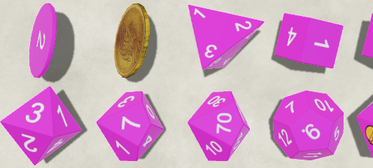

# Orksork's Dice so Nice Nice Dice
Sometimes my own genius astounds me. Here are some super cool dice to use that your friends will love.



Also I'm forking from LorduFreeman's ['Lordu's Custom Dice for Dice So Nice!'](https://github.com/LorduFreeman/foundry-lordudice) to figure out how to make the dice so I'm just gonna use his README formatting too. Bully for me.

## About/How to use
This module can only be used in conjunction with **Dice So Nice! (minimum version required 3.1.0)** and adds some dice. You can find them in the Dice So Nice setting if you look.

### How to use and combine styles
TODO: Forget to do this for 5 years.


## Installation
Use the integrated module manager in Foundry once it's there. If i'm too cool them still, you can manually use the manifest file URL below:

```
https://raw.githubusercontent.com/Orksork/foundry-emojidice/main/module.json
```

## Visual Previews
[fine then keep your secrets.jpg](pics/ART.png?raw=true)

## Feedback
For feedback write a letter and put it under your pillow. My servents will copy it through the astral plane and I'll read it.
For issues, open an issue here on Github.

## Credits
The images here on the README are created by Orksork. With licensing permission given by Orksork.

Made by ripping off Lordudice's dice pack. They're super chill and don't know I've done this at all. https://github.com/LorduFreeman/foundry-lordudice

## License
This work is licensed under the MIT License: https://mit-license.org
This work is licensed under Foundry Virtual Tabletop [EULA - Limited License Agreement for module development](https://foundryvtt.com/article/license/).

## TODO
Secret random 'fun'
More stuff
Fonts?
Models?
Texutres?
